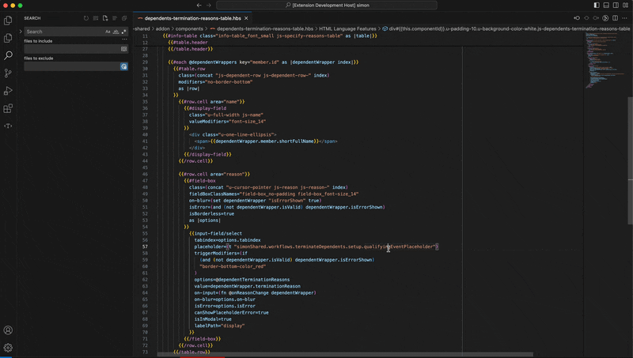

# Translation Mapper

You know when you're reading through some template and you find a translation key that maps to some text, and then you have to search for that translation key in the app to find out what the text is?
In my experience, I felt that this gets a bit annoying when you're dealing with multiple translations, or if you have multiple translation files, and there are many similar translation keys under different nested keys.
I think this just piles up into minutes that you could've spent focusing on the actual logic flow instead of looking for text mappings.

If this rings a bell, you can thank me later:
**Enter Translation Mapper!**

---

## 🚀 Demo

---

## ⚙️ Extension Settings

Here are some settings you can configure to make things run smoothly:

- `translationMapper.translationFilePaths`: Specifies the relative file path(s) where your translation file(s) are located.
  Defaults to `en-us.yaml`.

---

## 🐞 Known Issues

None yet — but let me know if you face any.

---

## 📋 Release Notes

### 1.0.0
- Initial release of Translation Mapper.

---

## ✨ Enjoy!
